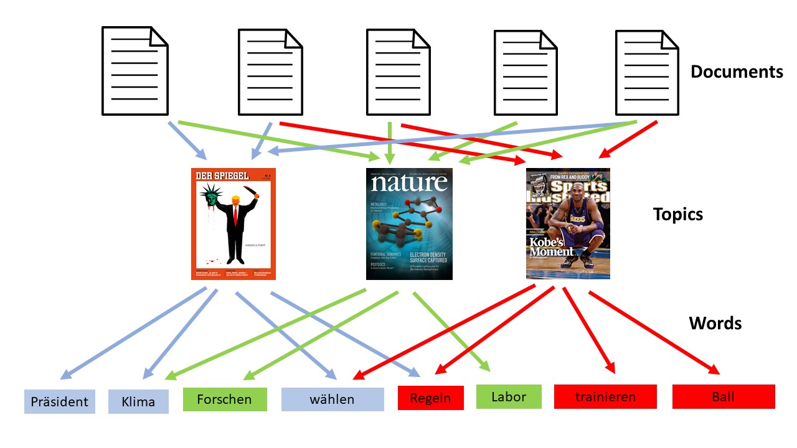

# Topic Modelling with Latent Dirichlet Allocation (LDA)

Latent Dirichlet Allocation (LDA) is a popular topic modelling technique.

The idea behind LDA is simple: Each document contains a small number of topics and each topic represents a set of words. And the goal of LDA is to map all the documents to the topics in a way, such that the words in each document are mostly captured by those topics. 



The LDA model gives us a bunch of topics that we can divide the topics on, e.g. "Sports", "Science", "Politics". In real life the algorithm throws some topics and it is up to us to look at the associated words and decide what is the topic of all these words


## Load data with Pandas


```python
file = r"bbc-texts.csv"
```


```python
import pandas as pd
import csv

'''
Load the dataset from the CSV and save it to 'dataframe_df'
'''
data = pd.read_csv(file)
dataframe_df = pd.DataFrame(data, columns=['category','text'])

# See the dimensions of the data frame:
dataframe_df.shape
```


    (2225, 2)


```python
'''
Take a look at your data
'''

dataframe_df[['category', 'text']]
```


<div>
<style scoped>
    .dataframe tbody tr th:only-of-type {
        vertical-align: middle;
    }

    .dataframe tbody tr th {
        vertical-align: top;
    }

    .dataframe thead th {
        text-align: right;
    }
</style>
<table border="1" class="dataframe">
  <thead>
    <tr style="text-align: right;">
      <th></th>
      <th>category</th>
      <th>text</th>
    </tr>
  </thead>
  <tbody>
    <tr>
      <th>0</th>
      <td>tech</td>
      <td>tv future in the hands of viewers with home th...</td>
    </tr>
    <tr>
      <th>1</th>
      <td>business</td>
      <td>worldcom boss  left books alone  former worldc...</td>
    </tr>
    <tr>
      <th>2</th>
      <td>sport</td>
      <td>tigers wary of farrell  gamble  leicester say ...</td>
    </tr>
    <tr>
      <th>3</th>
      <td>sport</td>
      <td>yeading face newcastle in fa cup premiership s...</td>
    </tr>
    <tr>
      <th>4</th>
      <td>entertainment</td>
      <td>ocean s twelve raids box office ocean s twelve...</td>
    </tr>
    <tr>
      <th>...</th>
      <td>...</td>
      <td>...</td>
    </tr>
    <tr>
      <th>2220</th>
      <td>business</td>
      <td>cars pull down us retail figures us retail sal...</td>
    </tr>
    <tr>
      <th>2221</th>
      <td>politics</td>
      <td>kilroy unveils immigration policy ex-chatshow ...</td>
    </tr>
    <tr>
      <th>2222</th>
      <td>entertainment</td>
      <td>rem announce new glasgow concert us band rem h...</td>
    </tr>
    <tr>
      <th>2223</th>
      <td>politics</td>
      <td>how political squabbles snowball it s become c...</td>
    </tr>
    <tr>
      <th>2224</th>
      <td>sport</td>
      <td>souness delight at euro progress boss graeme s...</td>
    </tr>
  </tbody>
</table>
<p>2225 rows × 2 columns</p>
</div>


## Check how many categories the texts have


```python
dataframe_df['category'].value_counts()
```


    sport            511
    business         510
    politics         417
    tech             401
    entertainment    386
    Name: category, dtype: int64


```python
texts = dataframe_df[['text']]
title = dataframe_df[['category']]
```

## Data Preprocessing ##

The following steps are performed:

* **Remove URL's**
* **Tokenization**: Split the text into sentences and the sentences into words. 
* **Lemmatize** the text: In languages like English and German words appear in several inflected forms. For example, in English, the verb 'to walk' may appear as 'walk', 'walked', 'walks', 'walking'. We use the base form or lemma of the word, 'walk', that one might look up in a dictionary.
* **Lowercase** the words and **remove punctuation**.
* Words that have **fewer than 3 characters are removed**.
* All **stopwords** are removed.


```python
import string
import re
#import nltk
from nltk.corpus import stopwords
import spacy


nlp = spacy.load("en_core_web_sm")

def preprocess(text): 
    text = re.sub("((\S+)?(http(s)?)(\S+))|((\S+)?(www)(\S+))|((\S+)?(\@)(\S+)?)", " ", text) #remove url's
    text = [t.lemma_ for t in nlp.tokenizer(text)] #lemmatize text
    text = [token.lower() for token in text] # lowercase text
    text = [re.sub('[%s]' % re.escape(string.punctuation), '', token) for token in text] #remove punctuation
    text = [re.sub('\w*\d\w*', '', token) for token in text] #remove numbers
    try:
        text = [word for word in text if len(word) > 2] #remove small words
        text = [word for word in text if word not in stopwords.words('english')] #remove stopwords
    except IndexError:
        pass
    return text
```

## Preprocess example


```python
preprocess("Boris Johnson has said people in England 'should be wearing' face coverings inside shops to help prevent the spread of coronavirus.")


```


    ['boris',
     'johnson',
     'say',
     'people',
     'england',
     'wear',
     'face',
     'covering',
     'inside',
     'shop',
     'help',
     'prevent',
     'spread',
     'coronavirus']


## Preprocess all texts in tha data set

A new category in the dataframe is created called **'preprocessed_texts'**.

**Note**: This may take a few minutes


```python
dataframe_df["preprocessed_texts"] = dataframe_df["text"].apply(preprocess) 

'''
Preview processed docs
'''
dataframe_df["preprocessed_texts"][:5]
```


    0    [future, hand, viewer, home, theatre, system, ...
    1    [worldcom, boss, leave, book, alone, former, w...
    2    [tiger, wary, farrell, gamble, leicester, say,...
    3    [yeading, face, newcastle, cup, premiership, s...
    4    [ocean, twelve, raid, box, office, ocean, twel...
    Name: preprocessed_texts, dtype: object


## Bag of words on the dataset

Create dictionary containing the number of times a word appears in the data set "preprocessed_texts". To do that, let's pass the texts to [`gensim.corpora.Dictionary()`](https://radimrehurek.com/gensim/corpora/dictionary.html).

Dictionary = {count how often word appears in data : word} --> {2:'walk', 1:'house', 5:'fire'}


```python
import gensim
from gensim.models import LdaModel
from gensim import models, corpora, similarities
```


```python
dictionary = gensim.corpora.Dictionary(dataframe_df["preprocessed_texts"])
```


```python
'''
Checking dictionary created
'''
count = 0
for k, v in dictionary.iteritems():
    print(k, v)
    count += 1
    if count > 10:
        break
```

    0 abide
    1 accord
    2 adam
    3 add
    4 advert
    5 advertise
    6 allow
    7 already
    8 also
    9 although
    10 announce
    

## Gensim filter out extremes

filter_extremes(no_below=5, no_above=0.7, keep_n=50000)

Filter out tokens that appear in...

* (1) words appear in less than **no_below** time in documents (absolute number)
* (2) words appear in more than **no_above** documents (fraction of total corpus size, not absolute number)
* after (1) and (2), keep only the first **keep_n most** frequent tokens (or keep all if None).


```python
'''
Remove very rare and very common words:

- words appearing less than 5 times
- words appearing in more than 50% of all documents
-keep the top 50,000 words 
'''

dictionary.filter_extremes(no_below=15, no_above=0.5, keep_n=50000)
```

## Convert document into the bag-of-words format (doc2bow)

[`doc2bow(document)`](https://radimrehurek.com/gensim/corpora/dictionary.html#gensim.corpora.dictionary.Dictionary.doc2bow)

* Convert document (a list of words) into the bag-of-words format = list of (token_id, token_count) 2-tuples. Each word is assumed to be a tokenized and normalized string (either unicode or utf8-encoded). 

Example:
bow_corpus = [(Token-ID, Token-Count), (Token-ID, Token-Count)....] --> [(71, 1), (107, 1), (462, 1), (3530, 1)...]


```python
'''
Create the Bag-of-words model for each document i.e for each document we create a dictionary reporting how many
words and how many times those words appear. Save this to 'bow_corpus'
'''
processed_docs = dataframe_df["preprocessed_texts"]

bow_corpus = [dictionary.doc2bow(doc) for doc in processed_docs]
```


```python
'''
Checking Bag of Words corpus for our sample document --> (token_id, token_count)
'''
bow_corpus[17]
```


    [(2, 1),
     (6, 1),
     (9, 1),
     (12, 2),
     (28, 1),
     (76, 2),
     (77, 1),
     (80, 1),
     (85, 1),
     (98, 4),
     (100, 2),
     (104, 1),
     (105, 1),
     (124, 1),
     (133, 1),
     (144, 1),
     (159, 1),
     (160, 1),
     (172, 1),
     (176, 1),
     (177, 4),
     (179, 1),
     (186, 1),
     (192, 4),
     (194, 1),
     (198, 3),
     (210, 1),
     (223, 1),
     (237, 1),
     (247, 1),
     (295, 1),
     (299, 1),
     (300, 1),
     (303, 1),
     (316, 1),
     (317, 2),
     (318, 1),
     (327, 2),
     (350, 1),
     (353, 3),
     (354, 2),
     (363, 1),
     (371, 1),
     (379, 1),
     (397, 2),
     (438, 1),
     (497, 1),
     (519, 1),
     (537, 2),
     (564, 1),
     (577, 1),
     (590, 2),
     (592, 1),
     (641, 1),
     (648, 2),
     (658, 1),
     (668, 1),
     (704, 2),
     (709, 1),
     (715, 1),
     (720, 1),
     (730, 1),
     (762, 1),
     (768, 1),
     (779, 2),
     (804, 1),
     (828, 1),
     (849, 1),
     (877, 1),
     (893, 1),
     (909, 1),
     (915, 6),
     (934, 4),
     (947, 2),
     (994, 1),
     (1009, 1),
     (1032, 1),
     (1043, 1),
     (1044, 1),
     (1045, 1),
     (1046, 1),
     (1047, 1),
     (1048, 1),
     (1049, 2),
     (1050, 1),
     (1051, 1),
     (1052, 1),
     (1053, 1),
     (1054, 1),
     (1055, 1),
     (1056, 2),
     (1057, 1),
     (1058, 1),
     (1059, 1),
     (1060, 1),
     (1061, 1),
     (1062, 1),
     (1063, 4),
     (1064, 1),
     (1065, 2),
     (1066, 3),
     (1067, 4),
     (1068, 1),
     (1069, 1),
     (1070, 2),
     (1071, 1),
     (1072, 1),
     (1073, 1),
     (1074, 1),
     (1075, 1),
     (1076, 1),
     (1077, 1),
     (1078, 1)]


```python
'''
Preview BOW for our sample preprocessed document
'''

bow_doc_1 = bow_corpus[1]

for i in range(len(bow_doc_1)):
    print("Word {} (\"{}\") appears {} time.".format(bow_doc_1[i][0], 
                                                     dictionary[bow_doc_1[i][0]], 
                                                     bow_doc_1[i][1]))
```

    Word 6 ("already") appears 1 time.
    Word 15 ("book") appears 2 time.
    Word 28 ("chief") appears 1 time.
    Word 33 ("company") appears 1 time.
    Word 63 ("find") appears 1 time.
    Word 64 ("firm") appears 2 time.
    Word 92 ("increase") appears 1 time.
    Word 100 ("know") appears 2 time.
    Word 107 ("lose") appears 2 time.
    Word 116 ("month") appears 1 time.
    Word 138 ("press") appears 1 time.
    Word 175 ("telecom") appears 2 time.
    Word 176 ("tell") appears 1 time.
    Word 202 ("ability") appears 1 time.
    Word 203 ("account") appears 5 time.
    Word 204 ("accuse") appears 1 time.
    Word 205 ("admission") appears 1 time.
    Word 206 ("admit") appears 2 time.
    Word 207 ("allegation") appears 1 time.
    Word 208 ("alone") appears 1 time.
    Word 209 ("argue") appears 1 time.
    Word 210 ("ask") appears 1 time.
    Word 211 ("assist") appears 1 time.
    Word 212 ("aware") appears 1 time.
    Word 213 ("behind") appears 1 time.
    Word 214 ("boom") appears 1 time.
    Word 215 ("boss") appears 3 time.
    Word 216 ("card") appears 1 time.
    Word 217 ("claim") appears 1 time.
    Word 218 ("client") appears 1 time.
    Word 219 ("collapse") appears 2 time.
    Word 220 ("comment") appears 1 time.
    Word 221 ("competition") appears 1 time.
    Word 222 ("cross") appears 1 time.
    Word 223 ("david") appears 1 time.
    Word 224 ("decision") appears 2 time.
    Word 225 ("declare") appears 1 time.
    Word 226 ("defence") appears 3 time.
    Word 227 ("distance") appears 1 time.
    Word 228 ("economist") appears 1 time.
    Word 229 ("entry") appears 2 time.
    Word 230 ("ever") appears 2 time.
    Word 231 ("expect") appears 1 time.
    Word 232 ("face") appears 1 time.
    Word 233 ("false") appears 1 time.
    Word 234 ("finally") appears 1 time.
    Word 235 ("financial") appears 1 time.
    Word 236 ("firmly") appears 1 time.
    Word 237 ("former") appears 3 time.
    Word 238 ("fraud") appears 3 time.
    Word 239 ("giant") appears 1 time.
    Word 240 ("graduate") appears 1 time.
    Word 241 ("guilty") appears 2 time.
    Word 242 ("hide") appears 1 time.
    Word 243 ("house") appears 1 time.
    Word 244 ("however") appears 1 time.
    Word 245 ("investor") appears 1 time.
    Word 246 ("jail") appears 1 time.
    Word 247 ("job") appears 1 time.
    Word 248 ("last") appears 1 time.
    Word 249 ("late") appears 2 time.
    Word 250 ("lawyer") appears 3 time.
    Word 251 ("leave") appears 1 time.
    Word 252 ("look") appears 1 time.
    Word 253 ("loss") appears 1 time.
    Word 254 ("meanwhile") appears 1 time.
    Word 255 ("monday") appears 1 time.
    Word 256 ("mount") appears 1 time.
    Word 257 ("never") appears 1 time.
    Word 258 ("officer") appears 1 time.
    Word 259 ("order") appears 1 time.
    Word 260 ("oversee") appears 1 time.
    Word 261 ("paint") appears 1 time.
    Word 262 ("peter") appears 1 time.
    Word 263 ("phone") appears 1 time.
    Word 264 ("plead") appears 1 time.
    Word 265 ("portray") appears 1 time.
    Word 266 ("problem") appears 2 time.
    Word 267 ("prosecutor") appears 2 time.
    Word 268 ("protect") appears 1 time.
    Word 269 ("question") appears 1 time.
    Word 270 ("relative") appears 1 time.
    Word 271 ("reply") appears 2 time.
    Word 272 ("request") appears 1 time.
    Word 273 ("responsible") appears 1 time.
    Word 274 ("scott") appears 1 time.
    Word 275 ("sentence") appears 1 time.
    Word 276 ("share") appears 1 time.
    Word 277 ("shareholder") appears 1 time.
    Word 278 ("substantial") appears 1 time.
    Word 279 ("sullivan") appears 2 time.
    Word 280 ("team") appears 1 time.
    Word 281 ("transform") appears 1 time.
    Word 282 ("trial") appears 2 time.
    Word 283 ("try") appears 2 time.
    Word 284 ("two") appears 1 time.
    Word 285 ("unknown") appears 1 time.
    Word 286 ("whatever") appears 1 time.
    Word 287 ("witness") appears 2 time.
    Word 288 ("worker") appears 1 time.
    Word 289 ("worldcom") appears 8 time.
    

## TF-IDF

During transformation, TF-IDF will take a vector and return another vector of the same dimensionality.

** TF-IDF stands for "Term Frequency, Inverse Document Frequency".**

* It is a way to score the importance of words (or "terms") in a document based on how frequently they appear across multiple documents.
* If a word appears frequently in a document, it's important. Give the word a high score. But if a word appears in many documents, it's not a unique identifier. Give the word a low score.
* Therefore, common words like "the" and "for", which appear in many documents, will be scaled down. Words that appear frequently in a single document will be scaled up.

In other words:

* TF(w) = `(Number of times term w appears in a document) / (Total number of terms in the document)`.
* IDF(w) = `log_e(Total number of documents / Number of documents with term w in it)`.

** For example **

* Consider a document containing `100` words wherein the word 'tiger' appears 3 times. 
* The term frequency (i.e., tf) for 'tiger' is then: 
    - `TF = (3 / 100) = 0.03`. 

* Now, assume we have `10 million` documents and the word 'tiger' appears in `1000` of these. Then, the inverse document frequency (i.e., idf) is calculated as:
    - `IDF = log(10,000,000 / 1,000) = 4`. 

* Thus, the Tf-idf weight is the product of these quantities: 
    - `TF-IDF = 0.03 * 4 = 0.12`.


```python
'''
Create tf-idf model object using models.TfidfModel on 'bow_corpus' and save it to 'tfidf'
'''
from gensim import corpora, models

tfidf = models.TfidfModel(bow_corpus)
```


```python
'''
Apply transformation to the entire corpus and call it 'corpus_tfidf'
'''
corpus_tfidf = tfidf[bow_corpus] 
```


```python
'''
Preview TF-IDF scores for our first document --> (token_id, tfidf score)
'''
from pprint import pprint

for doc in corpus_tfidf:
    pprint(doc)
    break
```

    [(0, 0.02543852414299371),
     (1, 0.06330510622053957),
     (2, 0.015403549437928996),
     (3, 0.058784434407235055),
     (4, 0.10936296018266457),
     (5, 0.05375278929619329),
     (6, 0.02395893643887232),
     (7, 0.02848679493181347),
     (8, 0.02931705114874563),
     (9, 0.03815651320088126),
     (10, 0.05978011186407569),
     (11, 0.0351171921067924),
     (12, 0.06215641285563375),
     (13, 0.03750592647644466),
     (14, 0.03356222204030799),
     (15, 0.03678234600373323),
     (16, 0.07736692597000144),
     (17, 0.2946351950924064),
     (18, 0.09219024609831647),
     (19, 0.045909802907438256),
     (20, 0.05399232917511457),
     (21, 0.06133471575447083),
     (22, 0.026480557588064457),
     (23, 0.10481971104447758),
     (24, 0.020522662155584112),
     (25, 0.11157277966978126),
     (26, 0.034086235424621136),
     (27, 0.22424277161784126),
     (28, 0.024360025843482867),
     (29, 0.07631302640176252),
     (30, 0.06264958610350967),
     (31, 0.043707888079170594),
     (32, 0.048322624434883374),
     (33, 0.05744664392382756),
     (34, 0.029104627794790377),
     (35, 0.04554665925361975),
     (36, 0.06802022684696547),
     (37, 0.1651374814032399),
     (38, 0.029642119358391686),
     (39, 0.06717025791681419),
     (40, 0.21334723623233867),
     (41, 0.03805355869510183),
     (42, 0.0800789057754267),
     (43, 0.03356222204030799),
     (44, 0.07039974470171491),
     (45, 0.043707888079170594),
     (46, 0.04418493809465712),
     (47, 0.050728226457984804),
     (48, 0.04386503018936576),
     (49, 0.019871116449841977),
     (50, 0.05366057164630603),
     (51, 0.05741693329668388),
     (52, 0.043247197326388855),
     (53, 0.05831483920094795),
     (54, 0.02322495566037382),
     (55, 0.07846385356107838),
     (56, 0.04052366735559614),
     (57, 0.04027937885736733),
     (58, 0.036233882208194755),
     (59, 0.04052366735559614),
     (60, 0.0654886288525602),
     (61, 0.06085552544373362),
     (62, 0.04181653881717035),
     (63, 0.04235636454522803),
     (64, 0.021004069720273296),
     (65, 0.022400433349465242),
     (66, 0.050994284602770154),
     (67, 0.06958293425885123),
     (68, 0.03257178975131081),
     (69, 0.040898635801882514),
     (70, 0.05617585180713519),
     (71, 0.0558887418387326),
     (72, 0.0994274898862534),
     (73, 0.06085552544373362),
     (74, 0.04746929024630625),
     (75, 0.08773006037873152),
     (76, 0.013592870968662324),
     (77, 0.012928654480746335),
     (78, 0.05503978125194271),
     (79, 0.023293156300526446),
     (80, 0.029052042611184006),
     (81, 0.05657694121174574),
     (82, 0.059950495852521206),
     (83, 0.030316846765698294),
     (84, 0.029104627794790377),
     (85, 0.021178182272614015),
     (86, 0.07906212972375724),
     (87, 0.0447369641848171),
     (88, 0.03632375209016923),
     (89, 0.05978011186407569),
     (90, 0.041025987440315236),
     (91, 0.031027258787476877),
     (92, 0.026437287028085434),
     (93, 0.07246776441638951),
     (94, 0.05540790009458323),
     (95, 0.048572408488487644),
     (96, 0.041547819914427936),
     (97, 0.066303150792884),
     (98, 0.0578574808713892),
     (99, 0.0426565309021085),
     (100, 0.019871116449841977),
     (101, 0.042512834374481896),
     (102, 0.05927305179085784),
     (103, 0.08909121103210013),
     (104, 0.042650039539614625),
     (105, 0.05510513675935052),
     (106, 0.026965964961575124),
     (107, 0.02492700859062367),
     (108, 0.03870260634932015),
     (109, 0.02174491323243534),
     (110, 0.035713862917714334),
     (111, 0.09803558856942934),
     (112, 0.04386503018936576),
     (113, 0.03868346298500072),
     (114, 0.08336301511469028),
     (115, 0.07590277424179148),
     (116, 0.01776599712011673),
     (117, 0.021325019769807312),
     (118, 0.05927305179085784),
     (119, 0.17197555516872795),
     (120, 0.03284457326434915),
     (121, 0.02410340554332328),
     (122, 0.04280178093580844),
     (123, 0.022115571146662422),
     (124, 0.0385467476525202),
     (125, 0.09992054949086568),
     (126, 0.039009847389458376),
     (127, 0.05657694121174574),
     (128, 0.132606301585768),
     (129, 0.045909802907438256),
     (130, 0.09643765054180564),
     (131, 0.04923385474218189),
     (132, 0.03385915119188799),
     (133, 0.05454041310080876),
     (134, 0.05126571802158612),
     (135, 0.034010113423482737),
     (136, 0.03912042823805826),
     (137, 0.031088190852276702),
     (138, 0.03764945312766341),
     (139, 0.04115455777322569),
     (140, 0.14739301080204442),
     (141, 0.04767759670203401),
     (142, 0.05302066512459559),
     (143, 0.0372571479647913),
     (144, 0.02363945117304561),
     (145, 0.045727004206517714),
     (146, 0.032503761771745354),
     (147, 0.0333437538566835),
     (148, 0.05366057164630603),
     (149, 0.04280178093580844),
     (150, 0.07341457315789139),
     (151, 0.18092118494458545),
     (152, 0.04386503018936576),
     (153, 0.0654886288525602),
     (154, 0.08230911554645139),
     (155, 0.09372614952342039),
     (156, 0.19198277141027187),
     (157, 0.09754103163611624),
     (158, 0.09181960581487651),
     (159, 0.013980379255101446),
     (160, 0.03784998666025834),
     (161, 0.04827953371431049),
     (162, 0.07347351567913403),
     (163, 0.07025447041068658),
     (164, 0.05927305179085784),
     (165, 0.11007956250388543),
     (166, 0.038364819656609),
     (167, 0.04195294097616112),
     (168, 0.04402403201265967),
     (169, 0.030316846765698294),
     (170, 0.05126571802158612),
     (171, 0.05810408522236801),
     (172, 0.030887757018657057),
     (173, 0.057791021550887535),
     (174, 0.14821059679195842),
     (175, 0.05126571802158612),
     (176, 0.031813910965320054),
     (177, 0.057584320573796546),
     (178, 0.051825611419906895),
     (179, 0.04746929024630625),
     (180, 0.022308732894877246),
     (181, 0.034791467129425616),
     (182, 0.03764945312766341),
     (183, 0.022432460771688274),
     (184, 0.0949385804926125),
     (185, 0.05657694121174574),
     (186, 0.01624660695838212),
     (187, 0.05927305179085784),
     (188, 0.041547819914427936),
     (189, 0.04536870304590729),
     (190, 0.0702343842135848),
     (191, 0.19417881530385675),
     (192, 0.11956964833257708),
     (193, 0.18677077793329028),
     (194, 0.03553199424023346),
     (195, 0.030259307074924906),
     (196, 0.12404913312179226),
     (197, 0.04628303516489229),
     (198, 0.016974151129918902),
     (199, 0.03815651320088126),
     (200, 0.030202012756712467),
     (201, 0.03291719430745862)]
    

## LDA with Bag of Words

We are going for 10 topics in the document corpus.

Some of the parameters:

* **num_topics** is the number of requested latent topics to be extracted from the training corpus.
* **id2word** is a mapping from word ids (integers) to words (strings). It is used to determine the vocabulary size, as well as for debugging and topic printing.
* **workers** is the number of extra processes to use for parallelization. Uses all available cores by default.
* **alpha** and **eta** are hyperparameters that affect sparsity of the document-topic (theta) and topic-word (lambda) distributions. We will let these be the default values for now (default value is `1/num_topics`)
    - Alpha is the per document topic distribution.
        * High alpha: Every document has a mixture of all topics (documents appear similar to each other).
        * Low alpha: Every document has a mixture of very few topics

    - Eta is the per topic word distribution.
        * High eta: Each topic has a mixture of most words (topics appear similar to each other).
        * Low eta: Each topic has a mixture of few words.

* ** passes ** is the number of training passes through the corpus. For  example, if the training corpus has 50,000 documents, chunksize is  10,000, passes is 2, then online training is done in 10 updates: 
    * Pass 1:
    * `#1 documents 0-9,9999 `
    * `#2 documents 10,000-19,999 `
    * `#3 documents 20,000-29,999 `
    * `#4 documents 30,000-39,999 `
    * `#5 documents 40,000-49,999 `
    * Pass 2:
    * `#6 documents 0-9,9999 `
    * `#7 documents 10,000-19,999 `
    * `#8 documents 20,000-29,999 `
    * `#9 documents 30,000-39,999 `
    * `#10 documents 40,000-49,999` 


```python
'''
Train LDA model using gensim.models.LdaMulticore. Save it to 'lda_model'
'''
lda_model = gensim.models.LdaMulticore(bow_corpus, 
                                       num_topics=5, 
                                       id2word = dictionary, 
                                       passes = 2, 
                                       workers=2)
```


```python
'''
For each topic, explore the words occuring in that topic and its relative weight
'''
for idx, topic in lda_model.print_topics(-1):
    print("Topic: {} \nWords: {}".format(idx, topic))
    print("\n")
```

    Topic: 0 
    Words: 0.007*"people" + 0.006*"new" + 0.005*"one" + 0.005*"use" + 0.005*"market" + 0.004*"company" + 0.004*"time" + 0.004*"good" + 0.004*"music" + 0.004*"firm"
    
    
    Topic: 1 
    Words: 0.006*"time" + 0.006*"people" + 0.005*"election" + 0.005*"new" + 0.005*"game" + 0.005*"get" + 0.005*"one" + 0.005*"party" + 0.005*"take" + 0.004*"labour"
    
    
    Topic: 2 
    Words: 0.006*"well" + 0.006*"show" + 0.006*"take" + 0.005*"one" + 0.005*"award" + 0.005*"win" + 0.005*"new" + 0.005*"people" + 0.005*"last" + 0.004*"film"
    
    
    Topic: 3 
    Words: 0.007*"film" + 0.006*"one" + 0.005*"new" + 0.005*"come" + 0.005*"play" + 0.004*"time" + 0.004*"take" + 0.004*"win" + 0.004*"good" + 0.004*"people"
    
    
    Topic: 4 
    Words: 0.006*"people" + 0.006*"win" + 0.006*"new" + 0.005*"take" + 0.005*"game" + 0.005*"last" + 0.005*"play" + 0.005*"use" + 0.005*"good" + 0.005*"get"
    
    
    

### Classification of the topics ###

Now it is up to you to categorise the topics based on the words and the corresponding weights 

* 0: 
* 1: 
* 2: 
* 3: 
* 4: 
* 5: 
* 6: 
* 7:  
* 8: 
* 9: 


## Running LDA using TF-IDF 


```python
'''
Define LDA model using corpus_tfidf, again using gensim.models.LdaMulticore()
'''
lda_model_tfidf = gensim.models.LdaMulticore(corpus_tfidf, 
                                       num_topics=5, 
                                       id2word = dictionary, 
                                       passes = 2, 
                                       workers=2) 
```


```python
'''
For each topic, explore the words occuring in that topic and its relative weight
'''
for idx, topic in lda_model_tfidf.print_topics(-1):
    print("Topic: {} \nWords: {}".format(idx, topic))
    print("\n")
```

    Topic: 0 
    Words: 0.003*"oil" + 0.002*"phone" + 0.002*"mobile" + 0.002*"labour" + 0.002*"election" + 0.002*"dollar" + 0.002*"party" + 0.002*"india" + 0.002*"yukos" + 0.002*"country"
    
    
    Topic: 1 
    Words: 0.003*"brown" + 0.002*"election" + 0.002*"win" + 0.002*"labour" + 0.002*"england" + 0.002*"game" + 0.002*"blair" + 0.002*"play" + 0.002*"party" + 0.002*"well"
    
    
    Topic: 2 
    Words: 0.003*"bank" + 0.003*"film" + 0.002*"award" + 0.002*"profit" + 0.002*"growth" + 0.002*"sale" + 0.002*"rise" + 0.002*"rate" + 0.002*"market" + 0.002*"show"
    
    
    Topic: 3 
    Words: 0.003*"film" + 0.003*"game" + 0.002*"win" + 0.002*"court" + 0.002*"play" + 0.002*"lord" + 0.002*"broadband" + 0.002*"people" + 0.002*"well" + 0.002*"star"
    
    
    Topic: 4 
    Words: 0.003*"film" + 0.003*"search" + 0.002*"file" + 0.002*"game" + 0.002*"music" + 0.002*"dvd" + 0.002*"technology" + 0.002*"card" + 0.002*"people" + 0.002*"use"
    
    
    

### Classification of the topics ###

As we can see, when using tf-idf, heavier weights are given to words that are not as frequent which results in nouns being factored in. That makes it harder to figure out the categories as nouns can be hard to categorize. This goes to show that the models we apply depend on the type of corpus of text we are dealing with. 

Now it is again up to you to categorise the topics based on the words and the corresponding weights

* 0: 
* 1:  
* 2: 
* 3: 
* 4:  
* 5: 
* 6: 
* 7: 
* 8: 
* 9: 

## Performance evaluation by classifying sample document using LDA Bag of Words model

We will check to see where our test document would be classified. 


```python
'''
Check which topic our test document belongs to using the LDA Bag of Words model.
'''
document_num = 3

print(processed_docs[3])

for index, score in sorted(lda_model[bow_corpus[document_num]], key=lambda tup: -1*tup[1]):
    print("\nPredicted Topic: {} ".format(index))
    print("Score: {}\t \nTopic Words: {}".format(score, lda_model.print_topic(index, 10)))
```

    ['yeading', 'face', 'newcastle', 'cup', 'premiership', 'side', 'newcastle', 'unite', 'face', 'trip', 'ryman', 'premier', 'league', 'leader', 'yeading', 'cup', 'round', 'game', 'arguably', 'highlight', 'draw', 'potential', 'money', 'spinner', 'non', 'league', 'yeading', 'beat', 'slough', 'round', 'conference', 'side', 'exeter', 'city', 'knock', 'doncaster', 'saturday', 'travel', 'old', 'trafford', 'meet', 'holder', 'manchester', 'unite', 'january', 'arsenal', 'draw', 'home', 'stoke', 'chelsea', 'play', 'host', 'scunthorpe', 'non', 'league', 'side', 'draw', 'hinckley', 'unite', 'hold', 'brentford', 'goalless', 'draw', 'sunday', 'meet', 'league', 'one', 'leader', 'luton', 'win', 'replay', 'martin', 'allen', 'team', 'griffin', 'park', 'numb', 'premiership', 'team', 'face', 'difficult', 'away', 'game', 'championship', 'side', 'weekend', 'january', 'place', 'everton', 'visit', 'plymouth', 'liverpool', 'travel', 'burnley', 'crystal', 'palace', 'sunderland', 'fulham', 'face', 'carling', 'cup', 'semi', 'finalist', 'watford', 'bolton', 'meet', 'ipswich', 'aston', 'villa', 'draw', 'sheffield', 'unite', 'premiership', 'struggler', 'norwich', 'blackburn', 'west', 'brom', 'away', 'west', 'ham', 'cardiff', 'preston', 'north', 'end', 'respectively', 'southampton', 'visit', 'northampton', 'already', 'beat', 'league', 'two', 'side', 'carling', 'cup', 'early', 'season', 'middlesbrough', 'draw', 'away', 'either', 'swindon', 'notts', 'county', 'spur', 'entertain', 'brighton', 'white', 'hart', 'lane', 'arsenal', 'stoke', 'swindon', 'notts', 'middlesbrough', 'man', 'utd', 'exeter', 'plymouth', 'everton', 'leicester', 'blackpool', 'derby', 'wigan', 'sunderland', 'crystal', 'palace', 'wolf', 'millwall', 'yeading', 'newcastle', 'hull', 'colchester', 'tottenham', 'brighton', 'read', 'stockport', 'swansea', 'birmingham', 'leeds', 'hartlepool', 'boston', 'milton', 'keynes', 'peterborough', 'oldham', 'man', 'city', 'chelsea', 'scunthorpe', 'cardiff', 'blackburn', 'charlton', 'rochdale', 'west', 'ham', 'norwich', 'sheff', 'utd', 'aston', 'villa', 'preston', 'west', 'brom', 'rotherham', 'yeovil', 'burnley', 'liverpool', 'bournemouth', 'chester', 'coventry', 'crewe', 'watford', 'fulham', 'ipswich', 'bolton', 'portsmouth', 'gillingham', 'northampton', 'southampton', 'qpr', 'nottm', 'forest', 'luton', 'hinckley', 'brentford', 'match', 'play', 'weekend', 'january']
    
    Predicted Topic: 4 
    Score: 0.7674515843391418	 
    Topic Words: 0.006*"people" + 0.006*"win" + 0.006*"new" + 0.005*"take" + 0.005*"game" + 0.005*"last" + 0.005*"play" + 0.005*"use" + 0.005*"good" + 0.005*"get"
    
    Predicted Topic: 1 
    Score: 0.22829054296016693	 
    Topic Words: 0.006*"time" + 0.006*"people" + 0.005*"election" + 0.005*"new" + 0.005*"game" + 0.005*"get" + 0.005*"one" + 0.005*"party" + 0.005*"take" + 0.004*"labour"
    

## Performance evaluation by classifying sample document using LDA TF-IDF model##


```python
'''
Check which topic our test document belongs to using the LDA TF-IDF model.
'''

for index, score in sorted(lda_model_tfidf[bow_corpus[document_num]], key=lambda tup: -1*tup[1]):
    print("\nPredicted Topic: {} ".format(index))
    print("Score: {}\t \nTopic Words: {}".format(score, lda_model.print_topic(index, 10)))
```

    
    Predicted Topic: 1 
    Score: 0.8668686151504517	 
    Topic Words: 0.006*"time" + 0.006*"people" + 0.005*"election" + 0.005*"new" + 0.005*"game" + 0.005*"get" + 0.005*"one" + 0.005*"party" + 0.005*"take" + 0.004*"labour"
    
    Predicted Topic: 0 
    Score: 0.08977082371711731	 
    Topic Words: 0.007*"people" + 0.006*"new" + 0.005*"one" + 0.005*"use" + 0.005*"market" + 0.004*"company" + 0.004*"time" + 0.004*"good" + 0.004*"music" + 0.004*"firm"
    
    Predicted Topic: 3 
    Score: 0.04051772505044937	 
    Topic Words: 0.007*"film" + 0.006*"one" + 0.005*"new" + 0.005*"come" + 0.005*"play" + 0.004*"time" + 0.004*"take" + 0.004*"win" + 0.004*"good" + 0.004*"people"
    

## Testing model on unseen document ##

Here you can provide the model with an text of your choice and see if the prediction of the model is correct


```python
unseen_document = """Bedecke deinen Himmel, Zeus, Mit Wolkendunst! Und übe, Knaben gleich, Der Disteln köpft, An 
Eichen dich und Bergeshöhn! Mußt mir meine Erde Doch lassen stehn, Und meine Hütte, Die du nicht gebaut, Und meinen Herd,
Um dessen Glut Du mich beneidest."""

# Data preprocessing step for the unseen document
bow_vector = dictionary.doc2bow(preprocess(unseen_document))

for index, score in sorted(lda_model[bow_vector], key=lambda tup: -1*tup[1]):
    print("\nPredicted Topic: {} ".format(index))
    print("Score: {} \nTopic Words: {}".format(score, lda_model.print_topic(index, 10)))
```

    
    Predicted Topic: 3 
    Score: 0.5947397351264954 
    Topic Words: 0.007*"film" + 0.006*"one" + 0.005*"new" + 0.005*"come" + 0.005*"play" + 0.004*"time" + 0.004*"take" + 0.004*"win" + 0.004*"good" + 0.004*"people"
    
    Predicted Topic: 0 
    Score: 0.10182727128267288 
    Topic Words: 0.007*"people" + 0.006*"new" + 0.005*"one" + 0.005*"use" + 0.005*"market" + 0.004*"company" + 0.004*"time" + 0.004*"good" + 0.004*"music" + 0.004*"firm"
    
    Predicted Topic: 2 
    Score: 0.10178206115961075 
    Topic Words: 0.006*"well" + 0.006*"show" + 0.006*"take" + 0.005*"one" + 0.005*"award" + 0.005*"win" + 0.005*"new" + 0.005*"people" + 0.005*"last" + 0.004*"film"
    
    Predicted Topic: 4 
    Score: 0.10087648034095764 
    Topic Words: 0.006*"people" + 0.006*"win" + 0.006*"new" + 0.005*"take" + 0.005*"game" + 0.005*"last" + 0.005*"play" + 0.005*"use" + 0.005*"good" + 0.005*"get"
    
    Predicted Topic: 1 
    Score: 0.10077443718910217 
    Topic Words: 0.006*"time" + 0.006*"people" + 0.005*"election" + 0.005*"new" + 0.005*"game" + 0.005*"get" + 0.005*"one" + 0.005*"party" + 0.005*"take" + 0.004*"labour"
    

## Sources:

* Intuitive Guide to Latent Dirichlet Allocation: https://towardsdatascience.com/light-on-math-machine-learning-intuitive-guide-to-latent-dirichlet-allocation-437c81220158
* Udacity Nanodegree Program "Natural Language Processing"

## Great Job!
